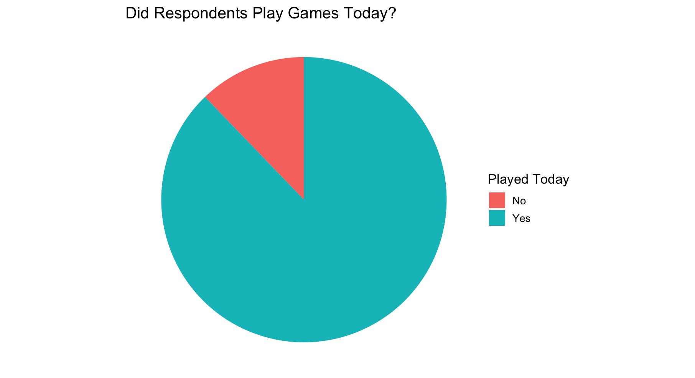
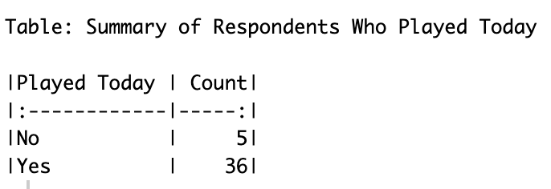
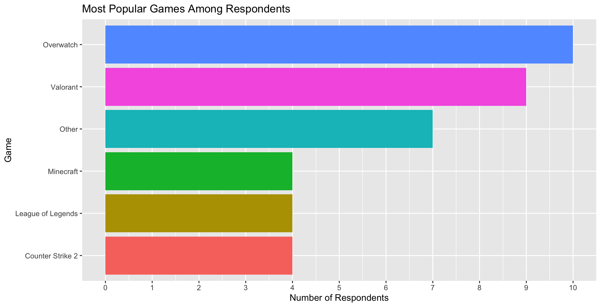
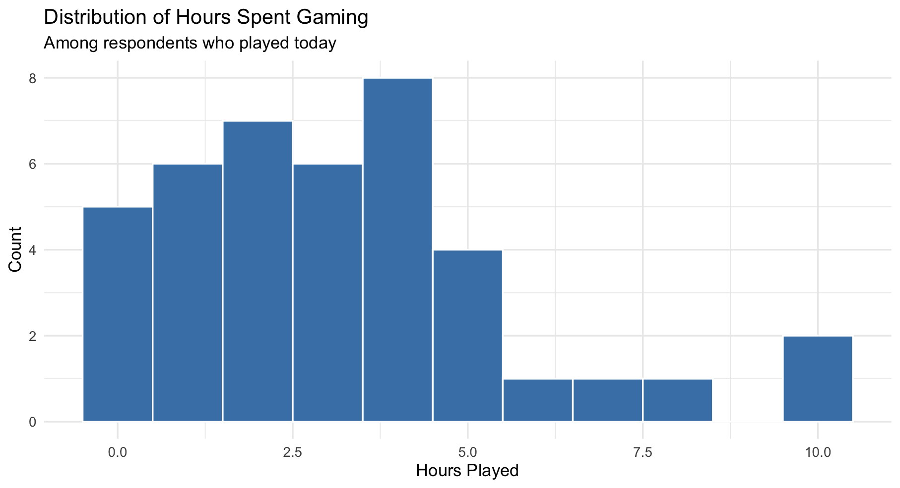
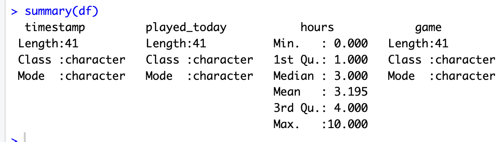
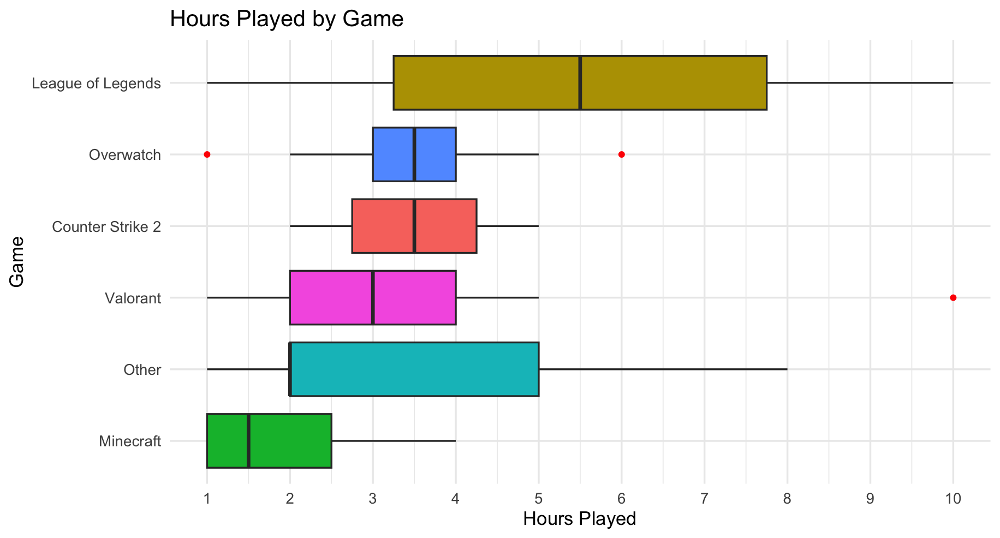

<script src="https://code.jquery.com/jquery-3.7.1.min.js" integrity="sha256-/JqT3SQfawRcv/BIHPThkBvs0OEvtFFmqPF/lYI/Cxo=" crossorigin="anonymous"></script>

```{r setup, include=FALSE}
knitr::opts_chunk$set(echo=FALSE, message=FALSE, warning=FALSE, error=FALSE)
```

```{js}
$(function() {
  $(".level2").css('visibility', 'hidden');
  $(".level2").first().css('visibility', 'visible');
  $(".container-fluid").height($(".container-fluid").height() + 300);
  $(window).on('scroll', function() {
    $('h2').each(function() {
      var h2Top = $(this).offset().top - $(window).scrollTop();
      var windowHeight = $(window).height();
      if (h2Top >= 0 && h2Top <= windowHeight / 2) {
        $(this).parent('div').css('visibility', 'visible');
      } else if (h2Top > windowHeight / 2) {
        $(this).parent('div').css('visibility', 'hidden');
      }
    });
  });
})
```

```{css}
body {
  background-color: #333333;
  font-family: Arial, sans-serif;
  color: #FFFFFF;
  padding: 25px;
}

h1 {
  color: #0080b3;
  font-size: 36px;
}

h2 {
  color: #0092cc;
  border-bottom: 3px solid #0092cc;
  padding-bottom: 5px;
  font-size: 30px;
}

h3 {
  color: #66bfde;
  font-size: 24px;
}

h4{
  color: #b3dded;
  font-size: 18px;
  border-bottom: 1px solid #b3dded;
  padding-bottom: 3px;
}
p {
  font-size: 16px;
  line-height: 1.6;
}

li{
  font-size: 16px;
  line-height: 1.6;
}

img {
  border-radius: 10px;
}

a {
  color: #7ec8a0;
  font-size: 18px;
  border-bottom: 1px solid #7ec8a0;
  padding-bottom: 2px;
}
```

## Introduction 

Video games has been a revolutionary invention in leisure and entertainment purposes since 1958, and amongst the most popular games today, action-adventure takes the lead as the most popular, and with in, shooter games are known to be the most dominant genre till this day. For my Stats 220 Project 4, I've collected an additional 20 samples, observing the gaming patterns of university students from data related to each respondents gaming frequency, to their preferred games, and their time usage on video games.


## Graphs





This is a pie chart of responses from respondents upon whether they played games on the days they reported to my survey, which is also the fist question in the observational survey I sent out.

From this pie chart and its summary tab, we can see that out of 41 respondents who responded to the survey, 36 of which responded to playing games that day and 5 of those reported no games played on the day.

My reason for using a pie chart for this section is because pie charts are very intuitive, we are looking at a catgorical variable with only yes and no as responese and pie chart shows us the proportions of each response right off the bat.




This bar chart allows insight on which games my respondents tend to play the most, which we can see, Overwatch and Valorant take up the majority of responses, at 10 responses and valorant at 9. Surprisingly, there were 7 respondents play games outside than the few popular ones ive listed, suggesting a wider variety of games played by my targeted audience that I did not expect and was not able to account for.

The reason of a bar chart for this category is due to the many variables/options the respondents had and which using a bar chart makes ot easier to compare numbers between the different games and with colour visualizations, we are given a more clear visual representation than any other plots.





From this histogram, we can see that the plot is heavily left skewed with majority of my respondents play under 5 hours and rarely above that. There also seems to be 2 respondents reporting 10 hours a day, and 0 respondents reporting 9 hours a day. 

From the summary tab, we can see that on average, my respondents played games for around 3.195 hours a day.

I chose a histogram for the second category because played hours is a continuous numeric variable where histograms a specifically designed to group these numeric data points into bins, which allows us to be able to instantly notice any trends, shapes and outliers of our collected data.




Based on this box plot, we can see that League of Legends has the most variation in game time reported, resulting in a very stretched box plot, with a median of 5.5 hours, also League Of lenegds players are shown to game longer than other game's players, this may be due to the nature of the game itself, and how long lasting it is compared to other games.

Other games tend to have more tamed and consistent gaming hours reported, seen by the shorter and more compact box plots. Games like Overwatch, Counter Strike 2, and Valorant all seem to have the median game time sitting in the middle of the box of the box plot where Other games and Minecraft has median game times more skewed to the left. Unlike League Of Legends players having a roughly equal number of low and high reported gaming hours, the "Other" category shows that there are more short gaming periods reported than long ones as the median is heavily skewed to the right.

There are also 3 outlined outliers within our data, 2 for Overwatch and 1 for Valorant. These outliers are represented as red dots, indicating that they do not lie within 1.5 times the IQR, justifying the identity of an ourlier.

With this graph, we are given the possibility that game time may be affected by the different type of game, with Valorant as an example, the range of 2-4 hours suggest around 2-5 games per session, for Others, there couold be story based games that take longer and faster paced games such as Lethal company or roblox. 

A box plot was fitted for this graph with the reason being that we are investigating the relationship between 2 variables, "Hours Played"(numerical) and "Game" (categorical). A box plot allows us to isolate and compare game time distributions between different games side by side, revealing outliers, median, spread and skewness for each game.


## Conclusion
Over all, based off my investigation, My project utilized observational logging and visual communications through plots and summaries to reveal gaming preferrences and patterns. I was able to transform the raw observational data into a visualized report using plots, colour themes and manipulation techniques, resulting in a report much easier and accessible to those who may not be as experiences dealing with raw data.

Althought the collected data is relatively small and limited in terms of game selection and many other factors may not have been included, the results still provide a meaningful insight on university student's gaming patterns and preferences, and how game type could potentially be responsible for the difference in gaming hours.


